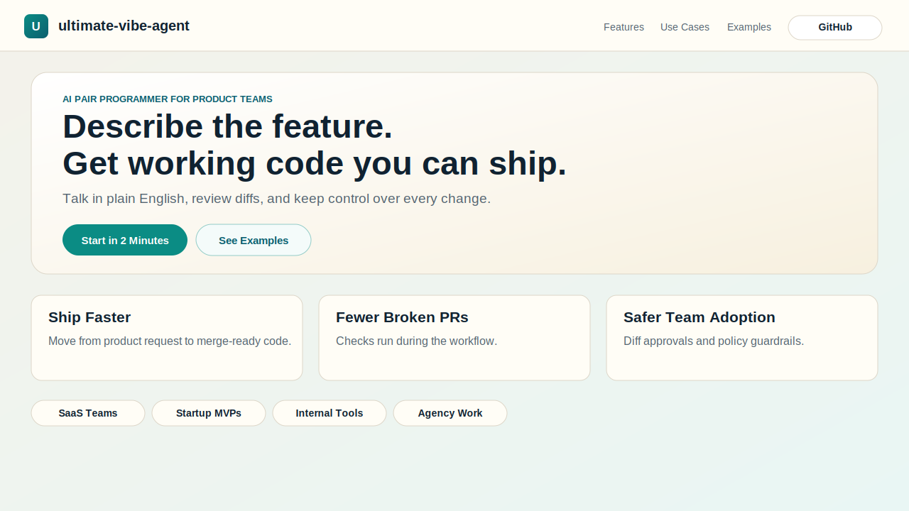
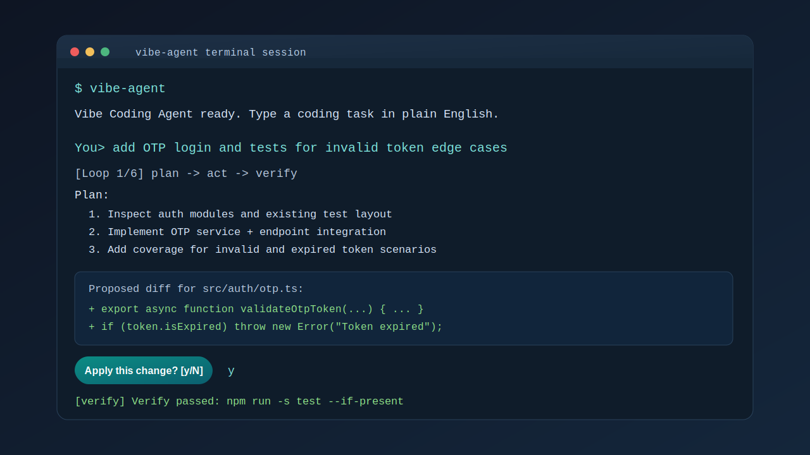
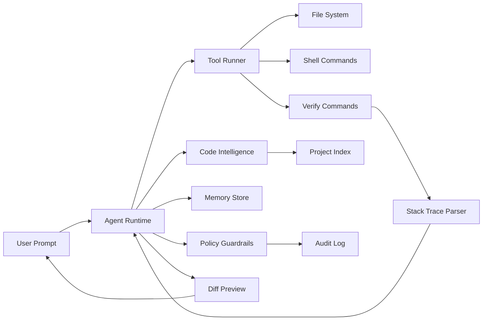

# ultimate-vibe-agent

[](https://nodejs.org/)
[](https://www.typescriptlang.org/)
[](https://console.groq.com/)
[](LICENSE)

An AI coding teammate for real product work.

Describe features in plain English.  
Get context-aware code changes, diff review, verification loops, and safer team adoption.

---

## Product Preview

### Landing Experience



### CLI Workflow



---

## Why Teams Use This

- Build faster from product request to working code
- Reduce broken PRs with verification in the loop
- Keep control with manual diff approval before writes
- Work inside existing codebases, not toy examples
- Add governance via policy controls and audit logs

---

## Core Product Capabilities

### Natural Language Feature Delivery
You can ask:

> "Add onboarding checklist with completion state and tests."

The agent plans and executes work against your project.

### Real Codebase Awareness
It reads multiple files, tracks symbols, understands imports/usages, and maps dependencies.

### Iterative Reliability Loop
It follows plan -> act -> verify and retries fixes when checks fail.

### Human-Controlled Editing
Every `write_file` is shown as diff and needs approval.

### Memory Across Sessions
Project conventions and architecture notes are persisted and reused.

### Team Safety
Policy rules, secret detection, audit trails, and rollback support.

---

## Architecture



---

## Quick Start

### 1) Install dependencies

```bash
npm install
```

### 2) Configure provider

Copy `.env.example` to `.env` and set:

```env
GROQ_API_KEY=your_groq_api_key_here
VIBE_MODEL=moonshotai/kimi-k2-instruct-0905
VIBE_BASE_URL=https://api.groq.com/openai/v1
```

### 3) Run interactive mode

```bash
npm run dev
```

### 4) Run one-shot task

```bash
npm run dev -- --goal "add forgot-password flow with tests"
```

---

## Usage Modes

### CLI

```bash
npm install -g ultimate-vibe-agent
vibe-agent
```

In-chat commands:

- `/task <goal>`
- `/config`
- `/help`
- `/exit`

### JavaScript SDK

```ts
import { CodingAgent, loadRuntimeConfig } from "ultimate-vibe-agent";

const config = loadRuntimeConfig(process.cwd(), {
  model: "moonshotai/kimi-k2-instruct-0905",
  baseUrl: "https://api.groq.com/openai/v1",
  maxIterations: 8,
});

const agent = new CodingAgent(config);

const ui = {
  info: console.log,
  warn: console.warn,
  error: console.error,
  ask: async () => "continue",
  confirm: async () => true,
};

await agent.runTask("refactor payment retries and add regression tests", ui);
```

### Python SDK Wrapper

```python
from vibe_agent_sdk import VibeAgentClient

client = VibeAgentClient(
    executable="vibe-agent",
    env={
        "GROQ_API_KEY": "your-key",
        "VIBE_MODEL": "moonshotai/kimi-k2-instruct-0905",
        "VIBE_BASE_URL": "https://api.groq.com/openai/v1",
    },
)

result = client.run_task(
    "optimize search endpoint and add test coverage",
    max_iterations=6,
    check=False,
)

print(result.returncode)
print(result.stdout)
```

Install the Python package:

```bash
pip install ultimate-vibe-agent
```

or

```bash
uv pip install ultimate-vibe-agent
```

---

## Built-In Tooling

- `list_files`
- `read_file`
- `grep`
- `run_command`
- `write_file` (approval required)
- `scan_project`
- `symbol_lookup`
- `find_references`
- `dependency_map`
- `memory_set`
- `memory_get`

---

## Safety and Governance

Default safeguards include:

- command policy checks
- blocked sensitive write paths (for example `.env`, `.git/*`)
- secret detection before write
- full session audit logs
- rollback option when unresolved failures remain

State artifacts:

- `.vibe-agent/memory.json`
- `.vibe-agent/policy.json`
- `.vibe-agent/index/project-index.json`
- `.vibe-agent/audit/*.jsonl`

---

## Configuration

| Variable | Purpose | Default |
|---|---|---|
| `GROQ_API_KEY` | Provider API key | empty |
| `VIBE_API_KEY` | Generic API key override | empty |
| `VIBE_MODEL` | Model name | `moonshotai/kimi-k2-instruct-0905` |
| `VIBE_BASE_URL` | OpenAI-compatible endpoint | `https://api.groq.com/openai/v1` |
| `VIBE_MAX_ITERATIONS` | Max loop rounds | `6` |
| `VIBE_TOOL_TIMEOUT_MS` | Tool timeout | `120000` |
| `VIBE_MAX_TOOL_OUTPUT_CHARS` | Output truncation limit | `18000` |
| `VIBE_MAX_SCAN_FILES` | Indexing limit | `6000` |
| `VIBE_AUTO_REPAIR_ROUNDS` | Retry cap for repeated failures | `3` |
| `VIBE_AUTO_VERIFY` | Auto-run verify commands | `true` |
| `VIBE_STATE_DIR` | Agent state directory | `.vibe-agent` |

---

## Build, Run, and Validate

```bash
npm run check
npm run build
npm run start
```

Python build:

```bash
npm run build:py
```

---

## Landing Page

Serve locally:

```bash
npm run landing:serve
```

Open `http://localhost:4173`.

Vercel deployment:

- Root Directory: `landing`

---

## Release

One-command release after version bump and commit:

```bash
release.cmd 0.1.1
```

Detailed checklist:

- `docs/release-plan.md`

---

## License

MIT - see `LICENSE`.
